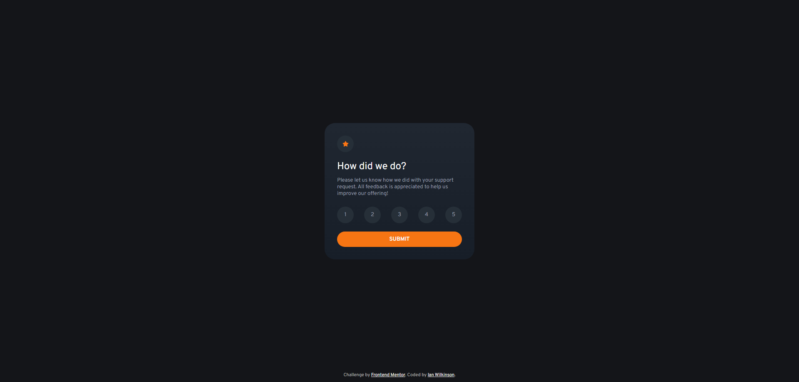
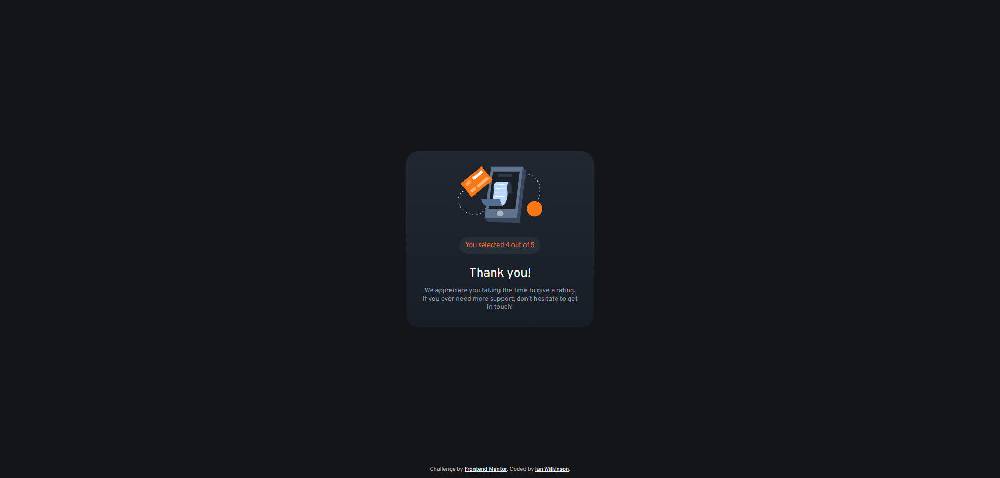
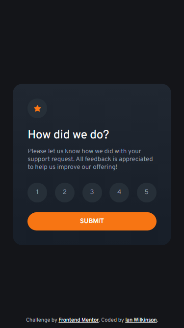

# Frontend Mentor - Interactive rating component solution

This is a solution to the [Interactive rating component challenge on Frontend Mentor](https://www.frontendmentor.io/challenges/interactive-rating-component-koxpeBUmI). Frontend Mentor challenges help you improve your coding skills by building realistic projects. 

## Table of contents

- [Overview](#overview)
  - [The challenge](#the-challenge)
  - [Screenshots](#screenshot)
  - [Links](#links)
- [My process](#my-process)
  - [Built with](#built-with)
  - [What I learned](#what-i-learned)
  - [Useful resources](#useful-resources)
- [Author](#author)

## Overview

### The challenge

Users should be able to:

- View the optimal layout for the app depending on their device's screen size
- See hover states for all interactive elements on the page
- Select and submit a number rating
- See the "Thank you" card state after submitting a rating

### Screenshots

Desktop




Mobile




### Links

- [Live Site URL](https://interactive-rating-ianwilk20.netlify.app/design/index.html)

## My process

### Built with

- Semantic HTML5 markup
- CSS
- Flexbox
- JavaScript

### What I learned

Hiding elements
- Previously I was hiding HTML elements with CSS by setting the ```visibility: "hidden"```. [I read that the best way to hide an element](https://developer.mozilla.org/en-US/docs/Web/CSS/visibility) so that the space created by the element is also hidden (removed from the document layout) is to instead use ```display: "none"```.

Storing state
- A effective way of storing state especially in a simple app like this one is to use local storage. Possibly for this use case, session storage would have been better since it expires when the session ends (page is closed).

Media queries range syntax
- Rather than using the typical media query as such:
```CSS
@media only screen and (min-width: 768px) and (max-width: 991px) {
  ...
}
```
- A range can be provided for the media query as such:
```CSS
@media (768px <= width <= 991px) {
  ...
}
```


### Useful resources

- [New syntax for range media queries](https://web.dev/articles/media-query-range-syntax) - This helped me learn the new range syntax for media queries.
- [Local storage](https://developer.mozilla.org/en-US/docs/Web/API/Window/localStorage) - A great article that helped me understand the purpose and use of localStorage and sessionStorage.

## Author

- GitHub - [ianwilk20](https://github.com/ianwilk20)
